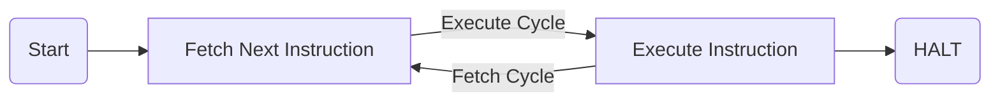

# System Calls

## System Call Interface
- Provides a controlled entry into the kernel
- Performs a priveledged / kernel level operation
- Interface represents part of the abstract machine offered by the operating system

### Some System Calls
#### Process Management
| Call | Description |
| :--- | :---------- |
| pid = fork() | Create a child process identical to the parent |
| pid = waitpid(pid, &statloc, options) | Wait for a child to terminate |
| s = execve(name, argv, environp) | Replace a process' core image |
| exit(status) | Terminate process execution and return status |

#### File Management
| Call | Description |
| :--- | :---------- |
| fd = open(file, how, ...) | Open a file for reading, writing or both |
| s = close(fd) | Close an open file |
| n = read(fd, buffer, nbytes) | Read data from a file into a buffer |
| n = write(fd, buffer, nbytes) | Write data from a buffer into a file |
| position = lseek(fd, offset, whence) | Move the file pointer |
| s = stat(name, &buf) | Get a file's status information |

---

## System Call Implimentation
### Simple Model of CPU Computation

### Priveleged-Mode Operation
| CPU Registers |
| :------------ |
| Interrupt Mask |
| Exception Type |
| MMU Regs |
| Others |
| PC: 0x0300 |
| SP: 0xcbf3 |
| Status |
| R1 |
| ... |
| Rn |

---

## Coprocessor 0
- Manages exceptions, interrupts, and translation

### Registers
#### Exception Management
| Register | Description |
| :------- | :---------- |
| c0_cause | Code of cause of exception |
| c0_status | Current status of the CPU |
| c0_epc | Address of the instruction that caused the exception; also where to restart execution after handle |
| c0_badvaddr | Address accessed that caused the exception |

#### Misc
| Register | Description |
| :------- | :---------- |
| c0_prid | Process Identifier |

#### Memory Management
| Register |
| :------- |
| c0_index |
| c0_random |
| c0_entryhi |
| c0_entrylo |
| c0_context |

### c0_status
- IM
    - Individual interrupt mask bits
    - 6 external
    - 2 software
- KU
    - 0 = kernel
    - 1 = usermode
- IE
    - 0 = all interrupts masked
    - 1 = interrupts enable
- c, p, o
    - current, previous, old

### c0_cause
- IP
    - Interrupts pending
- CE
    - Coprocessor error
- BD
    - If set, the instruction that caused the exception was in the branch delay slot
- ExcCode
    - The code number of the exception taken
