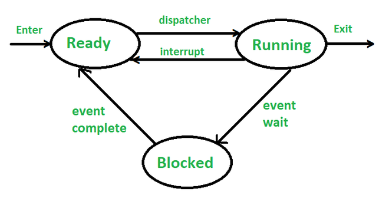

# W1 OS Tutorial Questions
## Operating Systems Intro
### What are some of the differences between a processor running in privileged mode (also called kernel mode) and user mode? Why are the two modes needed?

User Mode:
- Restricted mode; limits access to system resources
- Process must make system calls to access kernel mode resources or operations

Kernel Mode:
- Unrestricted access to system resources and operations
- Does NOT require syscalls; can engage with raw memory

Why?
- Security; ensures generic user processes cannot gain full, unfiltered access to computer

---

### What are the two main roles of an OS?

Abstraction Machine:
- Extends basic hardware with added functionality
- Provides high-level abstractions; more programmer friendly + common core
- Hides details of the hardware

Resource Manager:
- Responsible for the efficient allocation of resources to users and processes
- Must ensure processes don't Starve, and should apply the given allocation policy

---

### Given a high-level understanding of file systems, explain how a file system fulfills the two roles of an operating system?

As an Abstraction Machine:
- The file system exists in kernel mode; as such it offers a an API to abstract away the complexity and security concerns of writing raw data to the disk.

Resource Manager:
- A file manager has the role of maximising the efficiency of reads and writes, ensuring that the underlying hardware is used effectively.

---

### Which of the following instructions (or instruction sequences) should only be allowed in kernel mode?

1. Disable all interrupts == kernel mode
2. Read the time of day clock == user mode
3. Set the time of day clock == kernel mode
4. Change the memory map == kernel mode
5. Write to the hard disk controller register == kernel mode
6. Trigger the write of all buffered blocks associated with a file back to disk (fsync) == user mode

---

## OS System Call Interface
### The following code contains the use of typical UNIX process management system calls: fork(), execl(), exit() and getpid(). Read, and then answer the subquestions.
```c
#include <sys/types.h>
#include <unistd.h>
#include <stdlib.h>
#include <stdio.h>

#define FORK_DEPTH 3

int main(void)
{
  int i, r;
  pid_t my_pid;

  my_pid = getpid();
  
  for (i = 1; i <= FORK_DEPTH; i++) {
    
    r = fork();
    
    if (r > 0) {
      /* we're in the parent process after
         successfully forking a child */
      
      printf("Parent process %d forked child process %d\n",my_pid, r);  
      
    } else if (r == 0) {
      
      /* We're in the child process, so update my_pid */
      my_pid = getpid();
      
      /* run /bin/echo if we are at maximum depth, otherwise continue loop */
      if (i == FORK_DEPTH) { 
        r = execl("/bin/echo","/bin/echo","Hello World",NULL);
        
        /* we never expect to get here, just bail out */
        exit(1);
      }
    } else { /* r < 0 */
      /* Eek, not expecting to fail, just bail ungracefully */
      exit(1);
    }
  }
}
```

#### What is the value of i in the parent and child after fork?
Same value as the parent that called it.

#### What is the value of my_pid in a parent after a child updates it?
Parent's pid never changes.

#### What is the pid of /bin/echo?
Same as the pid that summoned it.


#### Why is the code after ```execl()``` not expected to be reached in the normal case?
```execl()``` doesn't create a new process, it replaces the current process image with a new program. Thus, the code after ```execl()``` should be replaced, and not reached.

#### How many times is Hello World printed when FORK_DEPTH is 3?
4 times; ONLY printed by the final children

#### How many processes are created when running the code (including the first process)?
8 processes;
- 1 Original
- 1 First Gen
- 2 Second Gen
- 4 Final Gen

---

### More Code Analysis
```c
#include <sys/types.h>
#include <sys/stat.h>
#include <fcntl.h>
#include <stdio.h>
#include <stdlib.h>
#include <string.h>

// GLOBAL string
char teststr[] = "The quick brown fox jumps over the lazy dog.\n";

int main(void)
{
  int fd;
  int len;
  ssize_t r;

  /*
    fd -> "file descriptor": map index of new file returned by open(...)
    open -> syscall to load file from file system to process file map
      "testfile" -> name of file
      O_WRONLY | O_CREAT -> bitwise mask; CREATE file as WRITE only.
      0600 ->  0 (prefix), 6 (Owner), 0 (Group), 0 (Others); file permission bits in OCTAL
  */
  fd = open("testfile", O_WRONLY | O_CREAT, 0600);
  if (fd < 0 /* AKA if open(...) failed */) {     
    /* just ungracefully bail out */
    perror("File open failed");
    exit(1);
  }

  len = strlen(teststr);
  printf("Attempting to write %d bytes\n",len);

  /* 
   * r -> number of bytes written successfully to the file; returned by write(...)
   * write -> syscall to write to file in file system
   *   fd -> file descriptor: file system idx
   *   teststr -> pointer to string to write to file
   *   len -> length of string
   */
  r = write(fd, teststr, len);

  /* write(...) returns -1 if failed */
  if (r < 0) {
    perror("File write failed");
    exit(1);
  }

  /* otherwise... success! */
  printf("Wrote %d bytes\n", (int) r);

  /* removes file from process file map */
  close(fd);

}
```

#### What does the above code do?
Refer to comments. It attempts to open a new file called "testfile", and writes the contents of ```teststr[]``` to that file.

#### In addition to O_WRONLY, what are the other two ways one can open a file?
1. O_RDONLY -> "Read Only"
2. O_RDWR -> "Read and Write"

#### What does ```open(...)``` return to ```fd```? What is it used for? Consider success and failure in your answer.
If ```open(...)``` is unable to open the file, it returns `-1`. If it succeeds, it returns a file descriptor. This is the key of the file in the process's virtual file map; the file ID used to reference the open file in the context of the specific process.

---

### Even More Code Analysis
```c
#include <sys/types.h>
#include <sys/stat.h>
#include <fcntl.h>
#include <stdio.h>
#include <stdlib.h>
#include <string.h>

char teststr[] = "The quick brown fox jumps over the lazy dog.\n";

main()
{
  int fd;
  int len;
  ssize_t r;
  off_t off;


  fd = open("testfile2", O_WRONLY | O_CREAT, 0600);
  if (fd < 0) {
    /* just ungracefully bail out */
    perror("File open failed");
    exit(1);
  }
  
  len = strlen(teststr);
  printf("Attempting to write %d bytes\n",len);
  
  r = write(fd, teststr, len);

  if (r < 0) {
    perror("File write failed");
    exit(1);
  }
  printf("Wrote %d bytes\n", (int) r);

  /*
   * off -> final pointer location (bytes from beginning of file); returned by lseek(...)
   * lseek -> repositions 'cursor' in an open file
   *  fd -> file descriptor
   *  offset -> number of bytes to move
   *  whence -> the place to offset from; SEEK_SET, SEEK_CUR, SEEK_END
   */
  off = lseek(fd, 5, SEEK_SET);
  if (off < 0) {
    perror("File lseek failed");
    exit(1);
  }

  r = write(fd, teststr, len);

  if (r < 0) {
    perror("File write failed");
    exit(1);
  }
  printf("Wrote %d bytes\n", (int) r);
  
  close(fd);

}
```

#### How big is the file (in bytes) after the two writes?
50 bytes: ```The qThe quick brown fox jumps over the lazy dog.\n```

#### What is ```lseek()``` doing that is affecting the final file size?
It seeks to the 5th byte, and repastes the string; it overwrites every original character past 'q'.

#### What over options are there in addition to ```SEEK_SET```?
1. SEEK_SET -> start of file
2. SEEK_CUR -> current file pointer
3. SEEK_END -> end of file

---

### Compile either of the previous two code fragment on a UNIX/Linux machine and run ```strace ./a.out``` and observe the output.
#### What is ```strace``` doing?
```srtace``` prints out each syscall made in the lifetime of a given program.

#### WIthout modifying the above code to print ```fd```, what is the value of the file descriptor used to write to the open file?
```fd == 3```. It is the first, non-standard file in the process's file map, and is thus assigned the first available file descriptor.

#### ```printf``` does not appear in the system call trace. What is appearing in it's place? What's happening here?
```printf``` is not a system call -> it is an abstraction of ```write``` with ```stdout``` as the set file.

---

### Even Even More Code Analysis
```c
#include <unistd.h>
#include <stdlib.h>
#include <stdio.h>
#include <errno.h>

main()
{
  int r;
  r = chdir(".."); /* on success, returns 0; else, returns -1 */
  if (r < 0) {
    perror("Eek!");
    exit(1);
  }
  
  r = execl("/bin/ls","/bin/ls",NULL); /* replaces the current process image with /bin/ls process */
  perror("Double eek!");
}
```

#### What does the following code do?
Equivalent of bash command: ```cd ../ && ls```

#### After the program runs, the current working directory of the shell is the same. Why?
Because each process is offered a unique sub-shell. Thus, the directory change is lost with the conclusion of the process.

#### In what directory does ```/bin/ls``` run in? Why?
It runs in ```../```. ```chmod("..")``` makes it so.

---

### On UNIX, which of the following are considered system calls? Why?
1. ```read()``` == syscall: direct interface with file system
2. ```printf()``` == syscall(ish): uses write under the hood -> direct interface with file system
3. ```memcpy()``` == user: simply moving memory around -> not destructive
4. ```open()``` == syscall: direct interface with file system
5. ```strncpy()``` == user: simply moving memory around -> not destructive 

---

## Processes and Threads
### In the three-state process model, what do each of the three states signify? What transitions are possible between each of the states, and what causes a process (or thread) to undertake such a transition?



1. Running -> process currently being executed by the CPU.
2. Ready -> process is ready to run, but is waiting for CPU time.
3. Blocked -> Is unable to execute even if given CPU time; waiting for a specific external event ie. I/O operation.


---

### Given N threads in a uniprocessor system. How many threads can be running at the same point in time? How many threads can be ready at the same time? How many threads can be blocked at the same time?

1. **Exactly 1** thread can be running at any given time.
2. Up to **N - 1** threads can be ready.
3. **ALL** threads could be blocked for various reasons.

---

### Compare reading a file using a single-threaded file server and a multithreaded file server. Within the file server, it takes 15 msec to get a request for work and do all the necessary processing, assuming the required block is in the main memory disk block cache. A disk operation is required for one third of the requests, which takes an additional 75 msec during which the thread sleeps. 

#### How many requests/sec can a server handled if it is single threaded? 
27; every 45ms, 75ms must be wasted.

#### If it is multithreaded?
67; this wastage does not occur; 1000 / 15ms ~= 67 requests.

---

## Critical Section
### The following fragment of code is a single line of code. How might a race condition occur if it is executed concurrently by multiple threads? Can you give an example of how an incorrect result can be computed for x.
```c
x = x + 1;
```

Consider the global variable ```x```, and two threads: T1 and T2. T1 loads ```x``` into an increment register. Then, T2 loads ```x``` into an increment register. T1 increments ```x```, then T2 increments ```x```. Where we would expect two increments to produce ```x = x + 2```, ```x``` is only incremented by one: a race condition.

---

### The following function is called by multiple threads (potentially concurrently) in a multi-threaded program. Identify the critical section(s) that require(s) mutual exclusion. Describe the race condition or why no race condition exists.
```c
int i;

void foo()
{
    int j;

    /* random stuff*/

    /* mutex_lock */
    i = i + 1;
    /* mutex_unlock */
    
    j = j + 1;

    /* more random stuff */
}
```

See commented code above for spefic critical section. Importantly, ```i``` is a GLOBAL variable, and thus is shared across all child processes. ```j``` is LOCAL to ```foo()```, and thus is NOT critical; it is NOT shared between unique processes.

---

### The following function is called by threads in a multi-thread program. Under what conditions would it form a critical section.

```c
void inc_mem(int *iptr)
{
    *iptr = *iptr + 1;
}
```

This code would form a critical section in the case that ```*iptr``` points to SHARED memory. This could be a global variable, but it could also be heap-allocated memory, static variables, or local variables from a parent thread.
